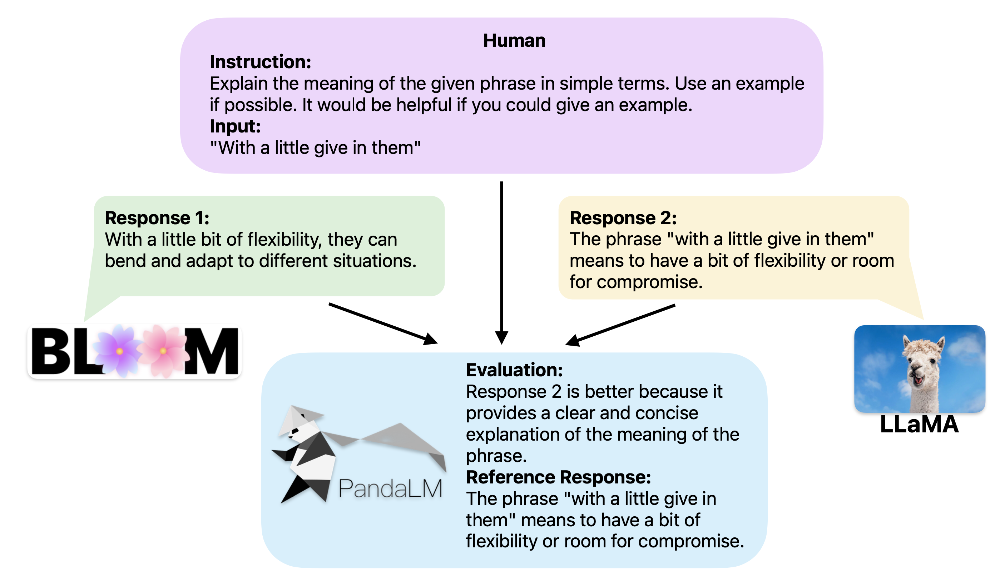
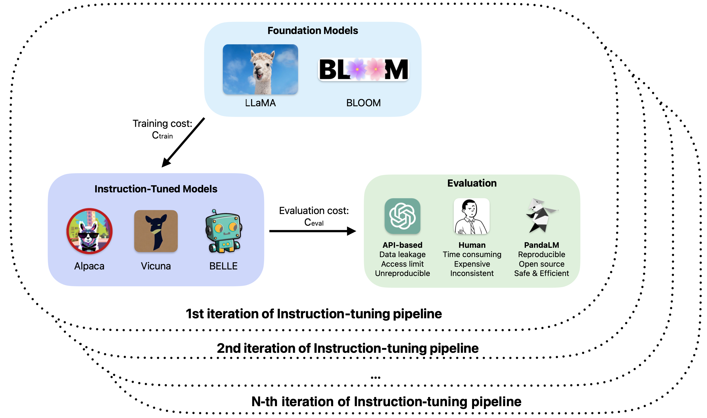

# PandaLM: Reproducible and Automated Language Model Assessment

<div align="center">
  <a href=" ">
    
  </a>
</div>

## Overview
This is the official repository for PandaLM: Re**P**roducible **and** **A**utomated **L**anguage **M**odel Assessment.

PandaLM aims to provide reproducible and automated comparisons between different large language models (LLMs). By giving PandaLM the same context, it can compare the responses of different LLMs and provide a reason for the decision, along with a reference answer. The target audience for PandaLM may be organizations that have confidential data and research labs with limited funds that seek reproducibility. These organizations may not want to disclose their data to third parties or may not be able to afford the high costs of secret data leakage using third-party APIs or hiring human annotators. With PandaLM, they can perform evaluations without compromising data security or incurring high costs, and obtain reproducible results. To demonstrate the reliability and consistency of our tool, we have created a diverse human-annotated test dataset of approximately 1,000 samples, where the contexts and the labels are all created by humans. **On our test dataset, PandaLM-7B has achieved xx% ChatGPT's evaluation ability**. **The papers and more features are coming soon.**



This repository contains:

- The codes for training PandaLM
- The human-annotated test dataset with ~1k samples for validating PandaLM's ability to evaluate LLMs
- The model weights of PandaLM
- The codes and configs for instruction tuning other foundation models such as Bloom, OPT and LLaMA, etc.

## News

- [2023/04/30] We are pleased to announce the release of PandaLM 1.0 as an open-source tool for evaluating LLMs with reliability. To further demonstrate the effectiveness of PandaLM, we are also sharing a human-annotated test dataset.

## **Table of Contents**

- [PandaLM: Panda Language Models](#pandalm-panda-language-models)
  - [News](#News)
  - [Table of Contents](#table-of-contents)
  - [Motivation](#motivation)
  - [Installation](#installation)
  - [Usage](#usage)
  - [Data](#data)
    - [Training data](#training-data)
    - [Test data](#test-data)
  - [ChatGPT VS PandaLM](#ChatGPT-VS-PandaLM)
  - [Conrtibuting](#conrtibuting)
  - [License](#license) 

## Motivation



As shown above, an iteration of the instruction tuning of LLMs includes training and evaluation. Each iteration refers to changes in hyper-paramters or fine tuning algorithms. The instruction tuning of LLMs can be done within a few GPU hours even using a consumer-grade GPU, thanks to parameter-efficient-tuning methods. However, the human-based and API-based evaluations can be more expensive and time consuming. Furthermore, they can be inconsistent and unreproducible due to a lack of transparency regarding LLM changelogs and subjectivity in human annotations. Moreover, the use of API-based evaluations can result in potential high costs of remediation after [secret data leakage](https://brb0k052i5.feishu.cn/docx/QXHUdwPSgo4puRxhllccfKPRnLg#J0Eed0uiYo2qG8xySY7cROs0nQe). Formally, the total cost of instruction tuning LLMs is $N \times (C_{train}+C_{cost})$, where $C_{train}$ can be significantly smaller than $C_{cost}$ if human-based or API-based evaluations are adopted. 

To address these challenges, we propose an evaluation model named PandaLM, which can ensure reproducibility, safety, and efficiency in evaluation. By automating the evaluation process, our model can achieve efficient and consistent evaluations while maintaining high evaluation ability. 

## **Installation**

To install PandaLM, follow these steps:

1. Clone the repository: `git clone https://github.com/WeOpenML/PandaLM.git`
2. Navigate to the project directory: `cd PandaLM`
3. Install the required dependencies: `pip install -r requirements.txt`

To instruction a foundation model, follow these steps:
1. Clone the repository: `git clone https://github.com/WeOpenML/PandaLM.git`
2. Navigate to the project directory: `cd PandaLM/pandalm`
3. Install the required dependencies: `pip install -r requirements.txt`
4. Run the demo scripts: `bash scripts/inst-tune.sh`

## **Usage**

We offer several choices for experiencing our PandaLM.

1. Try PandaLM on your local machine (with a GPU having at least 24G VRAM) using a Web UI: {}
2. Run PandaLM on batch data in a command-line script: {}
3. Train a new PandaLM in a command-line script: {}

## **Data**

This section introduces the train and test data for training and evaluating PandaLM. **We will continuously update and open-source the data to improve PandaLM.**

### **Train data**

We aim to force our model not only to evaluate different responses for a given context, but also generate a reference response utilizing the given context. Thus, each instance from the training data consists of an input tuple (instruction, input, response1, response2) and an output tuple (evaluation_result, evaluation_reason, reference_response). Specifically, in the input tuple, the instructions and inputs are sampled from [Alpaca 52K data](https://github.com/tatsu-lab/stanford_alpaca#data-release) and the response pairs are provided by LLaMA-7B, Bloom-7B, Cerebras-GPT-6.7B, OPT-7B and Pythia-6.9 tuned by ourselves with the same instruction data and hyper-parameters. We chose these foundation models as they are similar in size and their model weights are publicly available. The corresponding output tuple includes an evaluation result, a brief explanation for the evaluation and a reference response. Note that "1" or "2" in the evaluation result means response 1 or 2 is better and "Tie" means they are similar in quality. Since it is unaffordable to obtain *millions* of output tuples from human annotators and ChatGPT has the ability to evaluate LLMs to a certain extent, we follow [self-instruct](https://github.com/yizhongw/self-instruct/blob/main/human_eval) to get output tuples from ChatGPT(gpt-3.5-turbo) and then adopt heuristic data filtering strategy to filter noisy ones. The filtered train dataset contains 300K samples while the original unfiltered datasets have 1M samples. *The train data is under data disclosure procedure.* Here is a demonstration of the train data:

```Plain
{
    "inputs": {
        "instruction": "Find an example of the given kind of data",
        "input": "Qualitative data",
        "response1": "An example of qualitative data is customer feedback.",
        "response2": "An example of qualitative data is a customer review.",
    },
    "outputs": {
        "evaluation_result": "Tie",
        "evaluation_reason": "Both responses are correct and provide similar examples of qualitative data.",
        "reference_response": "An example of qualitative data is an interview transcript."
    }
}
```

### **Test data**

To prove the reliability of PandaLM, we created a **human-labeled test dataset** that is reliable and aligned to human preference of text. Each instance of the test dataset consists of one instruction and input, two responses generated by different instruction-tuned LLMs. The task is to compare the qualities of two responses. Similar to train data, the responses are provided by LLaMA-7B, Bloom-7B, Cerebras-GPT-6.7B, OPT-7B and Pythia-6.9B instruction-tuned by ourselves with the same instruction data and hyper-parameters. After obtaining the human-labeled test dataset, we can then compare ChatGPT and PandaLM in terms of evaluation performance.

The test data is generated and sampled from the human evaluation data of [self-instruct](https://github.com/yizhongw/self-instruct/blob/main/human_eval). The inputs and labels of test data are purely generated by humans and contain diverse tasks and contents. The labels are annotated independently by three different human evaluators. The data consists of a series of tasks, where each task includes an instruction, input sentence, two responses, and a label indicating the preferred response. Note that "1" or "2" means response 1 or 2 is better and "0" means they are similar in quality. Note that we exclude examples with big divergences from the origin annotated test data to make sure the IAA(Inter Annotator Agreement) of each annotator on the rest data is close to 0.85 because these filtered samples require additional knowledge or hard-to-obtain information, which makes it difficult for humans to evaluate them. The filtered test dataset contains 1K samples while the original unfiltered datasets have 2.5K samples. Here we give an example with explanations on the test set. *The test data is available in {}.*

```Plain
{
  "index": "749",
  "motivation_app": "CNN News",
  "task_id": "user_oriented_task_165",
  "cmp_key": "opt-7b_pythia-6.9b", ## It means response 1 is from opt-7B and response 2 is from pythia-6.9B
  "instruction": "Give the news title a category. Pick a category from the list of News & Buzz, Travel, Style, Arts & Culture, Politics, Tech, and Science & Health.",
  "input": "The #Banksy Exhibit in Cambridge, MA is absolutely terrific.",
  "reference_response": "Arts & Culture", ## Directly copy from the self instruct repo.
  "response1": "Politics",
  "response2": "Arts & Culture",
  "label_0": "2", # Label from Human annotator No.1
  "label_1": "2", # Label from Human annotator No.2
  "label_2": "2", # Label from Human annotator No.3
}
```

We calculate the IAA of each annotator using Cohen’s kappa. The IAA is shown below:

|              | Annotator #1 | Annotator #2 | Annotator #3 |
| ------------ | ------------ | ------------ | ------------ |
| Annotator #1 | 1            | 0.85         | 0.88         |
| Annotator #2 | 0.85         | 1            | 0.86         |
| Annotator #3 | 0.88         | 0.86         | 1            |

The label distribution of test data is:
|              | 0            |1             |2             |
| ------------ | ------------ | ------------ | ------------ |
| Number       | 105          | 422          | 472          |

## ChatGPT VS PandaLM

We compared the evaluation capabilities of ChatGPT(`gpt-3.5-turbo`) and PandaLM in terms of accuracy on our human-labeled dataset, Ownership, Reproducibility, security, etc. ChatGPT is opaque and unreproducible as it does not disclose any changelogs. Besides, users may encounter data leakage issues when using ChatGPT and some organizations have regulations against ChatGPT usage.

|         | Open Source | Reproducibility | Security | Access    |
| ------- | ----------- | --------------- | -------- | --------- |
| ChatGPT | ❌           | ❌               | ❌        | Limited   |
| PandaLM | ✅           | ✅               | ✅        | Unlimited |

|             | Test set Acc. |
| ----------- | ------------- |
| ChatGPT     | 71.07         |
| PandaLM-7B  | 63.36         |
| PandaLM-13B | ongoing       |
| PandaLM-33B | ongoing       |
| PandaLM-65B | ongoing       |

<div align="center">
  <a href=" ">
    
  </a>
</div>

## **Conrtibuting**

We welcome contributions to PandaLM! If you'd like to contribute, please follow these steps:

1. Fork the repository.
2. Create a new branch with your changes.
3. Submit a pull request with a clear description of your changes.

## Authors

Yidong Wang<sup>\*1,2</sup>, Zhuohao Yu<sup>\*1</sup>, Zhengran Zeng<sup>1</sup>, Linyi Yang<sup>2</sup>, Qiang Heng<sup>3</sup>, Cunxiang Wang<sup>2</sup>, Hao Chen<sup>4</sup>, Chaoya Jiang<sup>1</sup>, Rui Xie<sup>1</sup>, Jindong Wang<sup>5</sup>, Xing Xie<sup>5</sup>, Wei Ye<sup>†1</sup>, Shikun Zhang<sup>†1</sup>, and Yue Zhang<sup>†2</sup>.

*: Co-first Authors, work done during Yidong's internship at Westlake University.

†: Co-corresponding Authors

<sup>1</sup> Peking University, <sup>2</sup> Westlake University, <sup>3</sup> North Carolina State University, <sup>4</sup> Carnegie Mellon University, <sup>5</sup> Microsoft Research Asia

## Citation

```Plain
@misc{PandaLM,
  author = {Wang Yidong and Yu Zhuohao and Zeng Zhengran and Yang Linyi and Heng Qiang and Wang Cunxiang and Chen Hao and Jiang Chaoya and Xie Rui and Wang Jindong and Xie Xing and Ye Wei and Zhang Shikun and Zhang Yue},
  title = {PandaLM: Reproducible and Automated Language Model Assessment},
  year = {2023},
  publisher = {GitHub},
  journal = {GitHub repository},
  howpublished = {\url{https://github.com/WeOpenML/PandaLM}},
}
```

## **License**

PandaLM is released under the Apache License. See the LICENSE file for more information.
